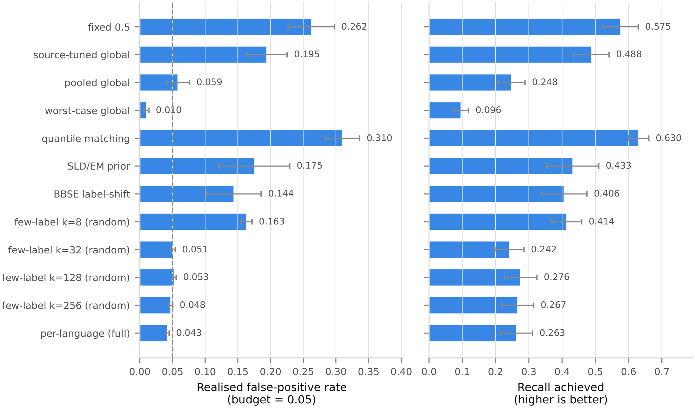
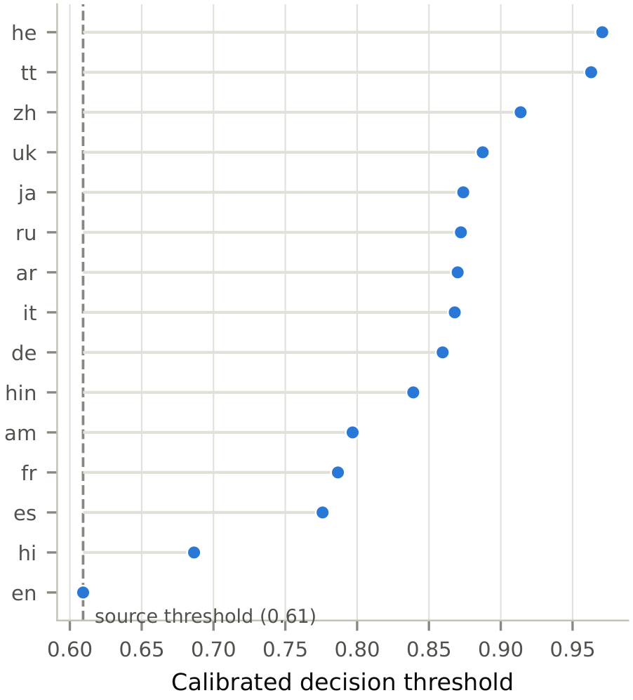
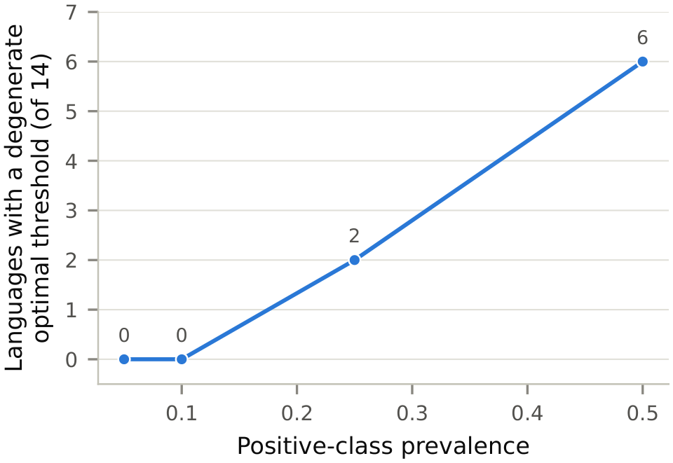
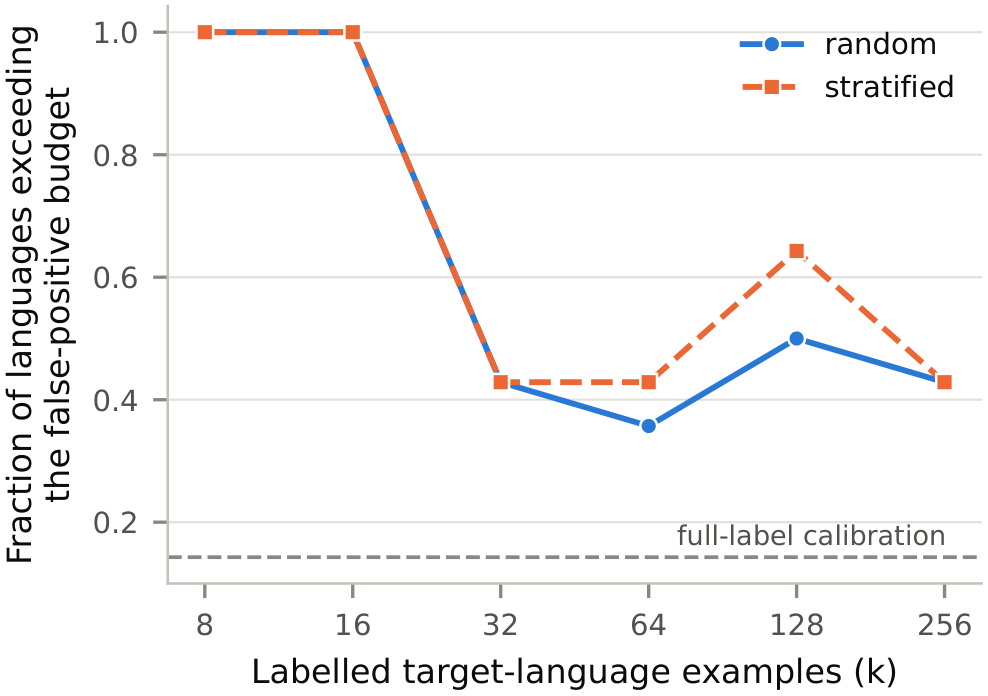
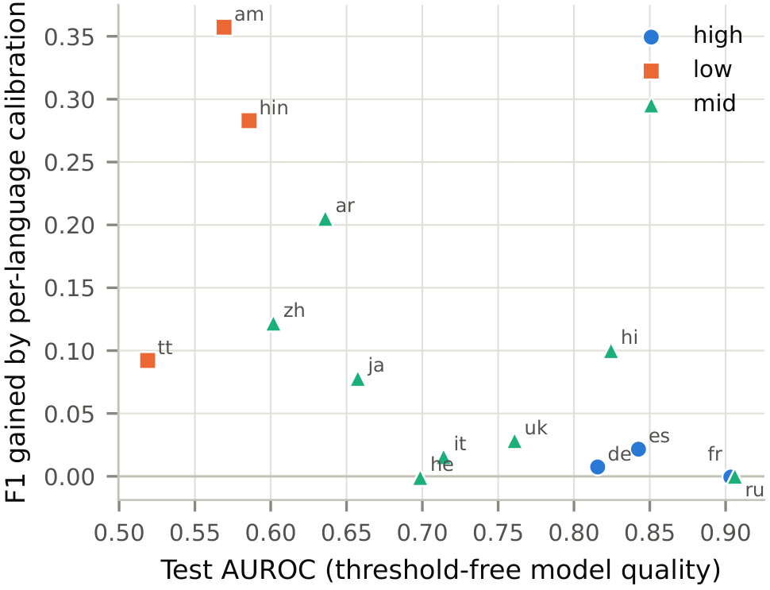

# NoTravel: Cross-Lingual Threshold Transfer in Multilingual AI

Reproduction artifact for *"The Operating Point Does Not Travel: Cross-Lingual Threshold
Transfer Fails by Over- and Under-Firing in Multilingual Text Classifiers"* (submitted to
*Computers, Materials & Continua*, CMC).

CPU-only; no GPU, no LaTeX, no paid API.

## Key results

A multilingual classifier is usually deployed behind one decision threshold, chosen on
validation data from one language and applied to all. This study asks whether an operating
point configured that way survives a change of language, with the model held fixed and only
the threshold varying.

- **The operating point does not transfer.** With a false-positive budget of 0.05 configured
  on English, all 14 target languages exceeded it: median realised false-positive rate 0.173
  (3.5x the budget), worst case 0.491 in Tatar.
- **The failure is not a content effect.** Each language's own optimal threshold sits a
  median 0.260 from the source-tuned one, and the divergence persists on a parallel corpus
  where every language carries translations of the same sentences with the same labels.
- **The direction of the harm is model-dependent.** Two deployed classifiers fail in opposite
  directions and disagree on the sign of the error in 8 of 14 languages: the
  XLM-RoBERTa-based classifier over-fires (median 1.83x its budget), while the
  DistilBERT-based one mostly under-fires (median 0.33x its budget) and its median recall
  falls from 0.729 on English to 0.047. Two systems establish model-dependence, not its
  distribution over models.
- **No remedy is both cheap and compliant.** Pooling the other languages cuts the violation
  rate from 1.000 to 0.286; the only threshold that never violates the budget cuts median
  recall from 0.504 to 0.071. Label-free adaptation did not achieve compliance.
- **The binding resource is target-language negatives, not labels.** Locating a
  false-positive quantile is limited by the expected number of permitted false positives,
  `m = alpha * n_neg`. The rule of thumb `m >= 10` is an in-sample summary of the regimes
  reported here and has not been validated on an independent corpus.
- **F1 on class-balanced corpora misleads.** At 50/50 balance the F1-optimal per-language
  threshold degenerates in 6 of 14 languages (Figure 5); the artefact disappears at
  deployment-realistic prevalence.

<p align="center">
  
  <br>
  <sub><b>Figure 2.</b> Realised false-positive rate (left) and recall (right) for each
  threshold-selection strategy; means over the 14 target languages with standard errors, dashed
  line = the 0.05 budget. The most conservative strategy never exceeds the budget, but only by
  barely firing.</sub>
</p>

<table>
  <tr>
    <td width="50%" align="center" valign="top">
      
      <br>
      <sub><b>Figure 1.</b> Per-language thresholds that meet a 0.05 false-positive budget,
      against the single English-tuned threshold (dashed). Median absolute difference 0.260;
      largest 0.361 (Hebrew).</sub>
    </td>
    <td width="50%" align="center" valign="top">
      
      <br>
      <sub><b>Figure 5.</b> Languages whose F1-optimal threshold is degenerate (flags over 80%
      of text) by positive-class prevalence: none at low prevalence, 6 of 14 at 50/50.</sub>
    </td>
  </tr>
</table>

**Supporting figures**

<table>
  <tr>
    <td width="50%" align="center" valign="top">
      
      <br>
      <sub><b>Figure 3.</b> Budget violations fall from 1.000 at k &le; 16 to 0.429 at k = 32 labelled examples.</sub>
    </td>
    <td width="50%" align="center" valign="top">
      
      <br>
      <sub><b>Figure 4.</b> F1 gained by per-language calibration is largest where AUROC is lowest (Spearman &minus;0.701).</sub>
    </td>
  </tr>
</table>

The publication-quality PDFs of all five figures are in
[`results/figures/`](results/figures/). The PNGs above are raster previews of those PDFs,
regenerated by `python scripts/make_figure_previews.py`; the PDFs are the reference.

## Reproduce

```bash
python -m pip install -r environment/requirements.txt
python scripts/reproduce_all.py --all      # regenerate everything (hours, CPU-only)
python scripts/reproduce_all.py --check    # verify an existing checkout (fast)
python scripts/reproduce_all.py --list     # show the stages without running them
```

`--all` runs 24 stages end to end: it downloads the pinned datasets and models, recomputes
every score, and rebuilds every result table and figure. `--check` verifies the committed
artifacts without recomputing them. Both must end `24/24 stages OK`.

One model is fetched outside the HuggingFace hub API because that path is unreliable for it.
If a run stops with a `local_dir ... is absent` error, follow the command it prints:

```bash
python scripts/fetch_model_direct.py --repo unitary/multilingual-toxic-xlm-roberta \
  --revision 4ad6f5c104d9ce813a1a2f33cac0c5b579ef6ee5 \
  --out data/models/unitary-multilingual-toxic-xlm-roberta
```

## Verify

```bash
python -m pytest tests/                 # 117 tests; 109 run here, 8 skip (see below)
python scripts/verify_results.py        # re-derive headline quantities from raw scores
```

`verify_results.py` recomputes the headline numbers directly from the preserved per-example
scores, without importing the analysis engine, so an error common to both would still show.
Every experiment output additionally carries a SHA-256 in its `provenance.json` (55
checksums), verified by `reproduce_all.py --check`.

Six further stages validate the manuscript itself: three emit its LaTeX tables, figures and
appendix from results that already exist, and three check its prose against those results.
They require `manuscript/`, which is not published, so `reproduce_all.py` reports them as not
applicable rather than as failures, and the eight tests covering the claim audit skip for the
same reason. No reported result depends on any of them.

## Layout

```
scripts/                reproduce_all.py, the analysis scripts, the verification scripts
src/                    data loading, model loading, evaluation protocol, statistics, figures
configs/                resources.yaml pins every dataset and model by revision hash
experiments/runs/       per experiment: provenance.json (revisions, seeds, versions,
                        SHA-256 of every output) and per_example_scores.parquet
results/{tables,figures}  every artifact a reported number is computed from
tests/                  unit tests for the metrics and statistics
environment/            requirements.txt and a captured environment snapshot
```

Per-example scores are released as Parquet (`language`, `split`, `score`, `label`), so every
result can be re-derived independently of this analysis code.

## Third-party material

Datasets and models are referenced by pinned revision and downloaded at run time; none is
redistributed here. Sources and exact terms: [`THIRD_PARTY_NOTICES.md`](THIRD_PARTY_NOTICES.md).

## Licence

This repository is not uniformly licensed. The original code — `scripts/`, `src/`, `tests/`,
`configs/`, `environment/` and the root documentation — is under the Apache License 2.0
([`LICENSE`](LICENSE)). The derived result artefacts under `experiments/` and `results/`
carry no corpus text but are computed from corpora under CC-BY-SA-4.0 and OpenRAIL++, so
they remain subject to those upstream terms and the Apache-2.0 grant does not extend to
them. Scope, per directory, and the verified upstream licences:
[`THIRD_PARTY_LICENSES.md`](THIRD_PARTY_LICENSES.md).

## Citation

See [`CITATION.cff`](CITATION.cff).
